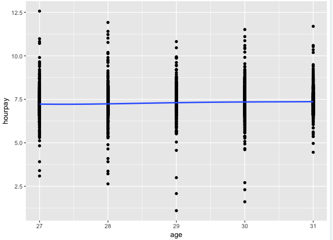

 
# P-Value should not be used to determine models. 

### Introduction:
This is a brief outline on why p-value should not be used to determine the structure of the model. P-Value is misleading, especially when your dataset cannot represent the entire population. One swallow does not make a summer; we should always ask this question: can your dataset represent the entire population? P-value significance is not the reason behind the logic of choosing such hypothesis nor model. 

### What is P-Value? 
In technical terms, a P value is the probability of obtaining an effect at least as extreme as the one in your sample data, assuming the truth of the null hypothesis.
Suppose that a vaccine study produced a P value of 4%. This P value indicates that assuming the vaccine had no effect, which is the Null Hypothesis, you’d obtain the observed difference or more in 4% of studies due to random sampling error. [Blog] 


### Real Example: Hourly Wage growth (NYLS97 Dataset)

We often see researchers control age as the independent variable when measuring dependent variables relate to wage. By doing so, they can eliminate the effect of age on wage and capture the effect of other independent variables, such as marriage, gender and family background.  
Thus, figuring out how age affect wage is important. Let’s simplify the model to 2 variables only: Age and Hourly Payment. Log(Wage) = Alpha +Beta_1 Age + Error Term. I will use NYLS97 data to demonstrate.
To conduct the analysis, I used data from the National Longitudinal Survey of Youth 1997, consisting of responses from approximately 9000 young people aged between 12 and 16 at the time of the first interview. This is the 2011 data. Hourly pay was labeled as T6658700.

```{r}
      #import NYLS97, preparation:
      mydata <- read_csv("Downloads/NYLS97/NYLS97.csv")
      colnames(mydata)<-c("year","hourpay")
      mydata["age"]<-2011-mydata["year"]
      NYLS97<-subset(mydata,hourpay>1)
      NYLS97["hourpay"]<-log(NYLS97["hourpay"])

      #run regression: linear
      NYLSfit<-lm(hourpay~age, data=NYLS97)
      coeftest(NYLSfit)
      plot(hourpay~age, data=NYLS97, main="NYLS97 Wage VS Age",xlab="Age",ylab="Wage in log")
      abline(lm(hourpay~age,data=NYLS97),col="red")

```


We can see from the graph that age has a significant impact on hourly wage. This is good because it indicates that including this variable would reduce misspecification problem. However, can we say that this is the best model because of p-value is significant with 5% significant level? Can we stop here?


### Another Example: ISLR Data
Let’s try this model with a different dataset. This data is from the R library, it contains sample for population between 18 and 80; to make this regression comparable to the previous one, I first look at data between 27-31, which is the same age range that NYLS97 has.

```{r}
WageTest <- subset(Wage, Wage["age"]<32 & Wage["age"]>26)
Testfit<- lm(logwage ~ age, data=WageTest)
coeftest(Testfit)
plot(logwage~ age, data=WageTest)
abline(lm(logwage~age,data=WageTest),col="green")
```


This looks almost exact the same to the plot generated by using NYLS97 dataset. Wow! replication! If you think this replication can prove that your model was super good, then you are probably deceived by P-Value. P-value only tells you that: if age has no effect on wage, you’d obtain the observed difference or more in less than 1% of studies due to random sampling error. 

Then, let’s look at the same dataset but contains age from 18 to 80.

```{r}
require(AER)
require(ISLR)
fit = lm(logwage ~ poly(age,4,raw=T),data=Wage)
coeftest(fit)
plot(logwage ~ age, data=Wage, main="ISLR data Wage VS Age", xlab="Age", ylab="Wage in log")
abline(fit,col="blue")
ggplot(Wage, aes(x=age, y=logwage)) + geom_point()+stat_smooth(se=F, method='lm', formula=y~poly(x,4))
```


According to the graph, it’s clear that the effect of age on wage is not linear. Wage increases from 18 to 35 years old but decreases after 60 years old. This is intuitively right. Wage increases fairly quick before when people are young, because of the increasing in return of the work experience. Young people are also get promoted quickly. But when age reaches 35, wage doesn’t change too much. This is because people generally get married, the learning ability decreases and people turn to stay in the job, they have less ambitious , and less human capital investment form the work placement. People who get married and have children, less time for self-improvement and self-studying. This make sense. After 60 years old, people are going to retire and the wage will decrease. wage doesn’t increase forever when age increases. therefore the polynomial to the degree of 4 is more intuitionally correct. 

### Revise NYLS97 and Partical ISLR datasets. 
Now let’s try what if we run regression with age contains polynomial to degree of 4 for NYLS97 dataset and Sub-ISLR dataset.

```{r}
require(ggplot2)
NYLSpoly <- lm(hourpay~poly(age,4,raw =T), data=NYLS97)
coeftest(NYLSpoly)
ggplot(NYLS97, aes(x=age, y=hourpay),main="polynomial to degree 4") +geom_point()+stat_smooth(se=F, method='lm'，formula=y~poly(x,4))

```


NYLS Dataset

```{r}
Testpoly <- lm(logwage ~ poly(age,4,raw=T),data=WageTest)
coeftest(Testpoly)
ggplot(WageTest, aes(x=age, y=logwage)) + geom_point()+stat_smooth(se=F, method='lm', formula=y~poly(x,4))

```


Sub-ISLR Dataset

P-Value shows not significant, it means: including X or not is not making any difference...
But if we only have dataset for people age between 27 and 32? what should we do? We should include X^4, because intuitively......
Theory and intuitions behind the model are evidence what we depend on when determinate the model, not the P-Value. Therefore, never say: I include this variable because it has significant P-Value!!. instead, you should say: I include/did not include this variable, because intuitively people in this age does..... or people do not.....


Reference: 

http://blog.minitab.com/blog/adventures-in-statistics-2/how-to-correctly-interpret-p-values


