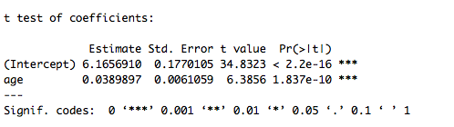

 
# P-Value is bad for determining the model structure. 

### Abstract:
This is a brief explanation of why p-value should not be used to determine the structure of the model. P-Value is misleading, especially when your dataset cannot represent the entire population. We should determine the model structure based on the theory or intuitions rather than whether P-value is significant or not.  P-value should not be the reason behind the logic of choosing a particular hypothesis or model. 

### What is P-Value? 
P value is the probability of obtaining an effect at least as extreme as the one in your sample data, assuming the truth of the null hypothesis. Suppose that a vaccine study produced a P value of 4%. This P value indicates that assuming the vaccine had no effect, which is the Null Hypothesis, you’d obtain the observed difference or more in 4% of studies due to random sampling error.  


### A Real Example: Hourly Wage growth 
We often see researchers control age as the independent variable when measuring dependent variables which are related to wage. By doing so, they can eliminate the effect of age on wage and capture the effect of other independent variables, such as marriage, gender and family background. Thus, figuring out how age affect wage is important. Let’s focus on a simple linear equation contains only 2 variables: Age and Hourly Payment: 

#### 1. NYLS97 Dataset
I first used the data from the National Longitudinal Survey of Youth 1997, consisting of responses from approximately 9000 young people aged between 12 and 16 at the time of the first interview. The data I downloaded contains information collected in 2011. The reference number of Hourly payment is T6658700.

```{r}
#import NYLS97, preparation:
mydata <- read_csv("Downloads/NYLS97/NYLS97.csv")
colnames(mydata)<-c("year","hourpay")
mydata["age"]<-2011-mydata["year"]
NYLS97<-subset(mydata,hourpay>1)
NYLS97["hourpay"]<-log(NYLS97["hourpay"])

#run regression: linear
NYLSfit<-lm(hourpay~age, data=NYLS97)
coeftest(NYLSfit)
plot(hourpay~age, data=NYLS97, main="NYLS97 Wage VS Age",xlab="Age",ylab="Wage in log")
abline(lm(hourpay~age,data=NYLS97),col="red")
```
 

We can see from the coefficient test that age has significant impacts on the hourly wage. P-Value here tells us: if you assume that age has no impact on wage, the likelihood of obtaining this dataset is almost 0. Some people would feel that this is good because it indicates that including the variable Age would reduce improve the misspecification problem. However, can we stop here? This P-Value tells you neither how good this model structure is nor how to improve it. 

### 2. Partial ISLR Dataset
Let’s try the same model with a different dataset. ISLR is the data stored in the R library, which contains sample subjects aged between 18 and 80. To make this regression comparable to the previous one, I first run a regression for sample subjects aged between 27 and 31 only.

```{r}
WageTest <- subset(Wage, Wage["age"]<32 & Wage["age"]>26)
Testfit<- lm(logwage ~ age, data=WageTest)
coeftest(Testfit)
plot(logwage~ age, data=WageTest)
abline(lm(logwage~age,data=WageTest),col="green")
```
 

The graph and the coefficient test look almost the same as the graph plotted by using NYLS97 dataset. Wow, replication! If you think this replication can prove that your model structure is good enough, then you are probably deceived by P-Value. P-value only tells you that: if age has no effect on wage, you’d obtain the observed difference or more in less than 1% of studies due to random sampling error. 

### 3. Full ISLR Dataset
Then, let’s look at the same dataset contains sample subjects aged between 18 and 80.
```{r}
require(AER)
require(ISLR)
fit = lm(logwage ~ poly(age,4,raw=T),data=Wage)
coeftest(fit)
plot(logwage ~ age, data=Wage, main="ISLR data Wage VS Age", xlab="Age", ylab="Wage in log")
abline(fit,col="blue")
ggplot(Wage, aes(x=age, y=logwage)) + geom_point()+stat_smooth(se=F, method='lm', formula=y~poly(x,4))
```


According to the graph, it’s clear that the effect of age on wage is nonlinear. we can see an upward trend between age 18 and 35, but a downward trend after age equal to 60. This is intuitively right, the change of the wage reflects the profit employees brought to the company. Young people are promoted easily and their wage is raised quickly due to the increased return of the work experience. But when people reach 35, wage doesn’t change too much. This is because people generally got married, their learning ability decreases, they have less ambitious, and less human capital investment form their employer. They have kids to look after; therefore, they have less time for self-studying. This makes sense. After 60 years old, people are going to retire and the wage will decrease. wage doesn’t increase forever when age increases. Therefore using the fourth-degree polynomial in age is more intuitionally correct. 


### 4. Revision: NYLS97 and Partical ISLR datasets. 
Now let’s try what if we run the regression with a fourth-degree polynomial in age using NYLS97 and Sub-ISLR datasets.
```{r}
require(ggplot2)
NYLSpoly <- lm(hourpay~poly(age,4,raw =T), data=NYLS97)
coeftest(NYLSpoly)
ggplot(NYLS97, aes(x=age, y=hourpay),main="polynomial to degree 4") +geom_point()+stat_smooth(se=F, method='lm'，formula=y~poly(x,4))

```


```{r}
Testpoly <- lm(logwage ~ poly(age,4,raw=T),data=WageTest)
coeftest(Testpoly)
ggplot(WageTest, aes(x=age, y=logwage)) + geom_point()+stat_smooth(se=F, method='lm', formula=y~poly(x,4))

```


According to both coefficient tests, P-values are not significant. The interpretation of such results is: assuming age has no effect on wage, the probabilities of obtaining such datasets are roughly 60%. 

However, let's think about what is happening in reality: You cannot really tell the difference between people aged 27 and 32 from their outlooks; their leadership skills,  family background, and education are key factors distinguish themselves from each other.  Although p-values of linear models are significant, nonlinear models are more intuitively correct and robust. 


### Conclusion: 
When determining the structure of the model, we should start by thinking the theory and logic behind the phenomenon that leads to the question we are interested in. Thus, instead of saying that I included this variable because it has a significant P-value, you should explain its' intuition and rationality. 


### Reference: 

"How to correctly interpret p value",2014, Minitab Blog, 17 April  http://blog.minitab.com/blog/adventures-in-statistics-2/how-to-correctly-interpret-p-values

Broniecki.P & Leemann.L, "Lab 7 – Polynomial Models",2013, Github, https://philippbroniecki.github.io/ML2017.io/day7.html


