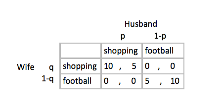
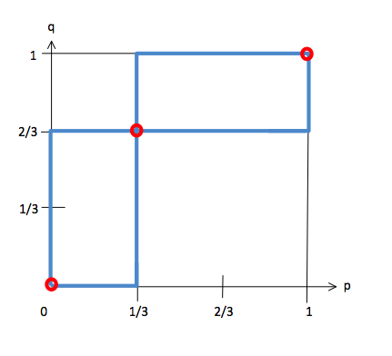

## Challenge: The Battle of Sex --- Game Theory with Pure Nash Equalibrium. 

# Abstract：
Using Rstudio to simulate a Discrete Utility Choice Model - The Battle of Sex - based on the concept of game theory:game of complete but imperfect information. 

## The Battle of Sex:
In game theory, battle of the sexes (BoS) is a two-player coordination game. Imagine a couple that agreed to meet this evening, but cannot recall if they will go shopping or watching football game (and the fact that they forgot is common knowledge). The husband would prefer to go to the football game. The wife would rather go shopping. Both would prefer to go to the same place rather than different ones. If they cannot communicate, where should they go? This is a classical decision making problem when one player's behaviour is depend on another one. 

The payoff matrix shown below is an example of Battle of the Sexes, where the wife chooses a row and the husband chooses a column. In each cell, the first number represents the payoff to the wife and the second number represents the payoff to the husband. The graph next to the payoff matrix is a mixed strategy with 3 nash equalibriums circled in red, meaning wife and husband both choose shopping or football, or with probabilities equal to 1/3(husband) and 2/3 (wife), at the same time would have no incentive to change their decision. 

 

## R code: 
```{r}
# Installing and importing packages:
install.packages("ramify")
require(ramify)
require(AER)
require(ggplot2)
require(MASS)
n<-200 # 200 wifes and 200 husbands. 
e1 <- rnorm(n,mean=0,sd=1) 
e2 <- rnorm(n,mean=0,sd=1)
e3 <- rnorm(n,mean=0,sd=1) 
e4 <- rnorm(n,mean=0,sd=1)
```
### Possibilities are exogeneouly generated: 
We firsly cumpute this model with p and q generated dandomly. This gives the best responds of wife and husband given all possibilities of p and q. Utility functions are coded for each cell, allowing wife and husband to make a discrete choice: choosing either shopping or football. 4 error terms are generated to make data points relistic and lines smoothly. As the mixed strategy graph below looks similar to the graph we drawn above, it indicates a successful simulation. 
```{r}
# p=Prob(shopping|Husband), q=Prob(shopping|Wife), random generation
p <- runif(n,min=0,max=1)
q <- runif(n,min=0,max=1)

#Utility Functions for each possible choice combination: 
U_shopping_wife <- 10*p+e1
U_football_wife <- 5*(1-p)+e2
U_shopping_hus <- 5*q+e3
U_football_hus <- 10*(1-q)+e4

# profit driven decision making
y_wife <- argmax(cbind(U_football_wife,U_shopping_wife))-1
y_hus <- argmax(cbind(U_football_hus,U_shopping_hus))-1
dataRandom <- data.frame(y_wife,y_hus,U_shopping_hus,U_football_hus,U_shopping_wife, U_football_wife, p , q)

#plot respectively:
ggplot(dataRandom, aes(x=p,y=y_wife))+geom_point()+stat_smooth(method="glm",method.args = list(family="binomial"), se=TRUE)
ggplot(dataRandom, aes(x=q,y=y_hus))+geom_point()+stat_smooth(method="glm",method.args = list(family="binomial"), se=TRUE)

wifefit <- glm(y_wife ~ p,family = binomial(link = "probit"))
coeftest(wifefit)
Rq <- fitted(wifefit) 

husfit <- glm(y_hus ~ q,family = binomial(link = "probit"))
coeftest(husfit)
Rp <- fitted(husfit) # wife Prob

plot(Rp,q,xlab = "p",ylab="q")
par(new=TRUE)
plot(p,Rq,xlab = "p",ylab="q")
```
 


### Captureing best respondings:
Now lets computing wife and husband's best respounds to each other's payoff functions. 
```{r}
n<-500 
## wife: t0-t1
e1 <- rnorm(n,mean=0,sd=1) 
e2 <- rnorm(n,mean=0,sd=1)
p_0 <- runif(n,min=0,max=1) #Hus Prob(random)
U_shopping_wife <- 10*p_0+e1
U_football_wife <- 5*(1-p_0)+e2
y_wife <- argmax(cbind(U_football_wife,U_shopping_wife))-1
wifefit <- glm(y_wife ~ p_0,family = binomial(link = "probit"))
coeftest(wifefit)
q_1 <- fitted(wifefit) # wife Prob

##Husband:t1-t2
e3 <- rnorm(n,mean=0,sd=1) 
e4 <- rnorm(n,mean=0,sd=1)
U_shopping_hus <- 5*q_1+e3
U_football_hus <- 10*(1-q_1)+e4
y_hus <- argmax(cbind(U_football_hus,U_shopping_hus))-1
husfit2 <- glm(y_hus ~ q_1,family = binomial(link="probit"))
coeftest(husfit2)
p_2 <- fitted(husfit2)

## Wife again:t2-t3
e5 <- rnorm(n,mean=0,sd=1) 
e6 <- rnorm(n,mean=0,sd=1)
U_shopping_wife2 <- 10*p_2+e5
U_football_wife2 <- 5*(1-p_2)+e6
y_wife2 <- argmax(cbind(U_football_wife2,U_shopping_wife2))-1
wifefit2 <- glm(y_wife ~ p_2,family = binomial(link = "probit"))
coeftest(wifefit2)
q_3 <- fitted(wifefit2) # wife Prob

##Hus again:t3-t4
e7 <- rnorm(n,mean=0,sd=1) 
e8 <- rnorm(n,mean=0,sd=1)
U_shopping_hus2 <- 5*q_3+e7
U_football_hus2 <- 10*(1-q_3)+e8
y_hus2 <- argmax(cbind(U_football_hus2,U_shopping_hus2))-1
husfit3 <- glm(y_hus ~ q_3,family = binomial(link="probit"))
coeftest(husfit3)
p_4 <- fitted(husfit3)

data<- data.frame(y_wife,y_hus,y_wife2,y_hus2,p_0,q_1,p_2,q_3,p_4, U_shopping_wife, U_football_wife, U_shopping_hus, U_football_hus,U_shopping_wife2,U_football_wife2 ,U_shopping_hus2,U_football_hus2 )

plot(p_0,q_1,col=rgb(1,0.2,0.2,0.2),pch=19,xlab = "p",ylab="q")
par(new=TRUE)
plot(p_2,q_1,col=rgb(0.2,0.2,1,0.2),pch=19,xlab="p",ylab="q")

plot(p_2,q_3,col=rgb(0.7,0.2,0.2,0.2),pch=19,xlab="p",ylab="q")
par(new=TRUE)
plot(p_4,q_3,col=rgb(0.2,0.2,0.7,0.2),pch=19,xlab="p",ylab="q")

```
 

h
### Conclusion: 


