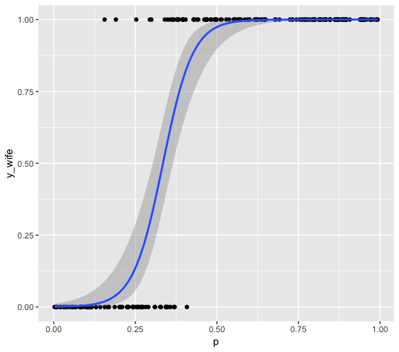
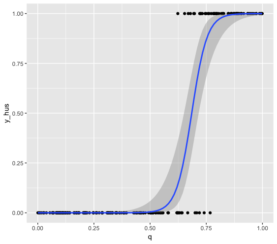
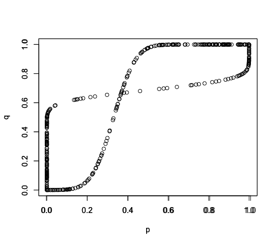
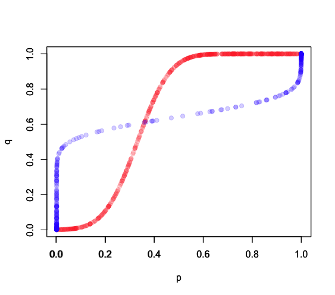
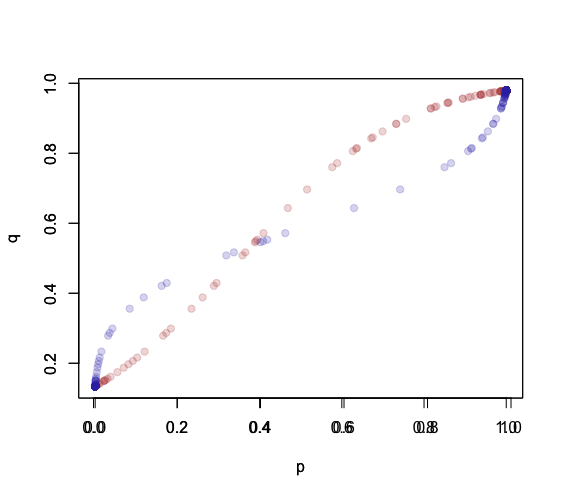
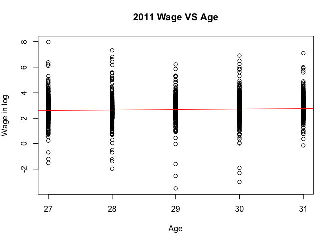

## Challenge: The Battle of Sex --- Game Theory with Pure Nash Equalibrium. 

### Abstract：


## The Battle of Sex:


## R code: 
```{r}
# Installing and importing packages:
install.packages("ramify")//R
require(ramify)
require(AER)
require(ggplot2)
require(MASS)
n<-200 # 200 wifes and 200 husbands. 
e1 <- rnorm(n,mean=0,sd=1) 
e2 <- rnorm(n,mean=0,sd=1)
e3 <- rnorm(n,mean=0,sd=1) 
e4 <- rnorm(n,mean=0,sd=1)
```


### Possibilities are exogeneouly generated: 

```{r}
# p=Prob(shopping|Husband), q=Prob(shopping|Wife), random generation
p <- runif(n,min=0,max=1)
q <- runif(n,min=0,max=1)

#Utility Functions for each possible choice combination: 
U_shopping_wife <- 10*p+e1
U_football_wife <- 5*(1-p)+e2
U_shopping_hus <- 5*q+e3
U_football_hus <- 10*(1-q)+e4

# profit driven decision making
y_wife <- argmax(cbind(U_football_wife,U_shopping_wife))-1
y_hus <- argmax(cbind(U_football_hus,U_shopping_hus))-1
dataRandom <- data.frame(y_wife,y_hus,U_shopping_hus,U_football_hus,U_shopping_wife, U_football_wife, p , q)

#plot respectively:
ggplot(dataRandom, aes(x=p,y=y_wife))+geom_point()+stat_smooth(method="glm",method.args = list(family="binomial"), se=TRUE)
ggplot(dataRandom, aes(x=q,y=y_hus))+geom_point()+stat_smooth(method="glm",method.args = list(family="binomial"), se=TRUE)

wifefit <- glm(y_wife ~ p,family = binomial(link = "probit"))
coeftest(wifefit)
Rq <- fitted(wifefit) 

husfit <- glm(y_hus ~ q,family = binomial(link = "probit"))
coeftest(husfit)
Rp <- fitted(husfit) # wife Prob

plot(Rp,q,xlab = "p",ylab="q")
par(new=TRUE)
plot(p,Rq,xlab = "p",ylab="q")
```
 

<centre>
    
</centre>
### Captureing best respondings:
```{r}
n<-500
## wife: 
e1 <- rnorm(n,mean=0,sd=1) 
e2 <- rnorm(n,mean=0,sd=1)
p_0 <- runif(n,min=0,max=1) #Hus Prob
U_shopping_wife <- 10*p_0+e1
U_football_wife <- 5*(1-p_0)+e2
y_wife <- argmax(cbind(U_football_wife,U_shopping_wife))-1
wifefit <- glm(y_wife ~ p_0,family = binomial(link = "probit"))
coeftest(wifefit)
q_1 <- fitted(wifefit) # wife Prob

data<- data.frame(y_wife,p_0,U_shopping_wife, U_football_wife,q_1)

ggplot(data, aes( x=p_0,y=y_wife))+geom_point()+stat_smooth(method="glm",method.args = list(family="binomial"), se=TRUE)


##Husband:1-2
e3 <- rnorm(n,mean=0,sd=1) 
e4 <- rnorm(n,mean=0,sd=1)
U_shopping_hus <- 5*q_1+e3
U_football_hus <- 10*(1-q_1)+e4


y_hus <- argmax(cbind(U_football_hus,U_shopping_hus))-1


data<- data.frame(y_wife,y_hus,p_0,q_1, U_shopping_wife, U_football_wife,U_shopping_hus, U_football_hus )

husfit2 <- glm(y_hus ~ q_1,family = binomial(link="probit"))
coeftest(husfit2)
p_2 <- fitted(husfit2)

data<- data.frame(y_wife,y_hus,p_0,q_1,p_2, U_shopping_wife, U_football_wife,U_shopping_hus, U_football_hus )

ggplot(data, aes( x=q_1,y=y_hus))+geom_point()+stat_smooth(method="glm",method.args = list(family="binomial"), se=TRUE)


## try wife again:add utility function!2-3
e5 <- rnorm(n,mean=0,sd=1) 
e6 <- rnorm(n,mean=0,sd=1)
U_shopping_wife2 <- 10*p_2+e5
U_football_wife2 <- 5*(1-p_2)+e6
y_wife2 <- argmax(cbind(U_football_wife2,U_shopping_wife2))-1
wifefit2 <- glm(y_wife ~ p_2,family = binomial(link = "probit"))
coeftest(wifefit2)
q_3 <- fitted(wifefit2) # wife Prob


data<- data.frame(y_wife,y_hus,y_wife2,p_0,q_1,p_2,q_3, U_shopping_wife, U_football_wife,U_shopping_hus, U_football_hus,U_shopping_wife2,U_football_wife2  )

ggplot(data, aes( x=p_2,y=y_wife2))+geom_point()+stat_smooth(method="glm",method.args = list(family="binomial"), se=TRUE)

##try hus again:3-4
e7 <- rnorm(n,mean=0,sd=1) 
e8 <- rnorm(n,mean=0,sd=1)
U_shopping_hus2 <- 5*q_3+e7
U_football_hus2 <- 10*(1-q_3)+e8


y_hus2 <- argmax(cbind(U_football_hus2,U_shopping_hus2))-1


husfit3 <- glm(y_hus ~ q_3,family = binomial(link="probit"))
coeftest(husfit3)
p_4 <- fitted(husfit3)

data<- data.frame(y_wife,y_hus,y_wife2,y_hus2,p_0,q_1,p_2,q_3,p_4, U_shopping_wife, U_football_wife, U_shopping_hus, U_football_hus,U_shopping_wife2,U_football_wife2 ,U_shopping_hus2,U_football_hus2 )

ggplot(data, aes( x=q_3,y=y_hus2))+geom_point()+stat_smooth(method="glm",method.args = list(family="binomial"), se=TRUE)

plot(p_0,q_1,col=rgb(1,0.2,0.2,0.2),pch=19,xlab = "p",ylab="q")
par(new=TRUE)
plot(p_2,q_1,col=rgb(0.2,0.2,1,0.2),pch=19,xlab="p",ylab="q")
par(new=TRUE)
plot(p_2,q_3,col=rgb(0.7,0.2,0.2,0.2),pch=19,xlab="p",ylab="q")
par(new=TRUE)
plot(p_4,q_3,col=rgb(0.2,0.2,0.7,0.2),pch=19,xlab="p",ylab="q")

```

 
 
### Conclusion: 


